# ETH-USD performance vs BTC, NASDAQ-100, and DXY (2021-2026)

A Jupyter notebook I wrote to figure out how Ethereum actually performed over five years, and whether the "ETH is a USD hedge" narrative survives contact with the data. The analysis is split in two:

- **Part I** is ETH vs the US Dollar Index (DXY). Returns, risk, drawdowns, then the correlation and regression work to test the hedge claim.
- **Part II** is the multi-asset comparison: ETH vs BTC, ETH vs NASDAQ-100, plus a pairwise heatmap so you can see how all four assets co-move.

The notebook is 50 cells. It pulls prices live from Yahoo Finance via `yfinance` on every run, so the numbers below are accurate to the run I'm describing - rerunning later will get slightly different figures because the dataset extends.

## Setup

Python 3.9 or newer.

```bash
pip install -r requirements.txt
```

Dependencies and what each is for:

| Library | Min version | What it does |
|---|---|---|
| numpy | >= 1.24 | Numerical work |
| pandas | >= 2.0 | Time-series handling |
| yfinance | >= 0.2 | Yahoo Finance price data |
| matplotlib | >= 3.7 | Plotting |
| seaborn | >= 0.12 | Statistical plots |
| scipy | >= 1.10 | Pearson, OLS |

## How to run

1. Open `main.ipynb` in Jupyter or JupyterLab.
2. Kernel -> Restart & Run All.

Prices come from Yahoo Finance on every run, so an internet connection is needed.

## Configuration

All the parameters live in two cells. Cell 03 for Part I, Cell 21 for the additional Part II tickers. Nothing else in the notebook is hardcoded.

```python
# Cell 03
START_DATE        = "2021-01-01"   # inclusive
END_DATE          = "2026-01-01"   # exclusive
ETH_TICKER        = "ETH-USD"
DXY_TICKER        = "DX-Y.NYB"     # ICE Dollar Index
RISK_FREE_ANNUAL  = 0.045          # ~4.5%, 3M T-bill avg over the period
ROLLING_WINDOW    = 12             # months, for everything rolling

# Cell 21
BTC_TICKER        = "BTC-USD"
NASDAQ_TICKER     = "^NDX"
```

## Methodology

**Prices.** Adjusted closes via `yfinance` with `auto_adjust=True`. I pull daily and resample to month-end with `resample("ME").last()`. Doing it that way (rather than asking Yahoo for monthly bars) keeps me in control of where the month boundary lands and avoids inconsistencies Yahoo sometimes has on its native monthly close dates. A 1-period forward-fill handles exchange holidays. Part II uses a `build_multi_asset_prices()` helper that aligns all four series on a shared month-end calendar.

**Returns.**

| Formula | What it is |
|---|---|
| `r_t = (P_t / P_{t-1}) - 1` | Simple monthly return |
| `ln_r_t = ln(P_t / P_{t-1})` | Log return (used for vol and correlation - time-additive, closer to normal) |
| `CAGR = prod(1 + r_t)^(12/n) - 1` | Compounded annual growth rate |

**Risk metrics.**

| Metric | Formula |
|---|---|
| Annualised vol | `monthly_std * sqrt(12)` |
| Sharpe | `(CAGR - Rf) / annual_vol` |
| Sortino | `(CAGR - Rf) / downside_vol` |
| Calmar | `CAGR / abs(max_drawdown)` |
| Max drawdown | `min((Cumulative - Peak) / Peak)` |

I look at Sortino as well as Sharpe because ETH's return distribution is positively skewed with fat tails - Sharpe punishes big positive months equally, which doesn't really make sense for an asset where huge upside is the point.

**Correlation work (ETH vs DXY).**

| Step | Method |
|---|---|
| Full-period correlation | Pearson rho on monthly simple returns |
| Significance test | Two-tailed t-test: `t = rho * sqrt((n-2)/(1-rho^2))` |
| Confidence interval | Fisher z-transform, back to rho scale |
| Regression | OLS: `r_ETH = alpha + beta * r_DXY + eps` |
| Rolling correlation | 12-month sliding window on log returns |
| Pairwise heatmap (Part II) | Pearson rho on log returns, all four assets |

**Why these specific assets.**

| Asset | Ticker | Why it's in here |
|---|---|---|
| Ethereum | `ETH-USD` | The subject |
| Bitcoin | `BTC-USD` | The other dominant crypto - natural peer comparison |
| NASDAQ-100 | `^NDX` | Tech-equity benchmark - tests whether ETH's vol premium is justified vs equities |
| DXY | `DX-Y.NYB` | ICE Dollar Index - geometrically weighted basket of USD vs EUR, JPY, GBP, CAD, SEK, CHF |

## Visualisations

Each cell produces a chart and saves it as a PNG (`01_*.png` through `13_*.png`).

Part I:

| # | Chart | Question it answers |
|---|---|---|
| 1 | Cumulative return: ETH vs DXY | How did $1 grow over 5 years? |
| 2 | Monthly return heatmap | Which months and years were good or bad? |
| 3 | Annual returns bar chart | How did yearly returns evolve? |
| 4 | Rolling vol and Sharpe | How did risk efficiency change over time? |
| 5 | Drawdown underwater chart | How deep and how long were the bear markets? |
| 6 | Correlation dashboard | What is the ETH-DXY statistical relationship? |

Part II:

| # | Chart | Question it answers |
|---|---|---|
| 7 | Normalized cumulative returns | How did all four assets grow from a common base of 100? |
| 8 | Annual returns comparison | Were crypto and equity gains in the same years? |
| 9 | Risk-return scatter | Where does each asset sit on the vol vs reward curve? |
| 10 | Multi-asset drawdown | How did bear-market depth and timing compare? |
| 11 | Pairwise correlation heatmap | How closely do the four assets co-move? |
| 12 | Rolling correlations | Has the ETH-BTC and ETH-NASDAQ relationship shifted? |
| 13 | Performance metrics summary table | Side-by-side of all the key numbers |

## What the numbers actually say

I'll caveat this: I'm describing the run I'm looking at. Rerun later and the trailing window shifts.

Headline metrics over the 60-month window:

| | ETH | BTC | NASDAQ-100 | DXY |
|---|---:|---:|---:|---:|
| Cumulative | +126% | (varies) | +95% | +9% |
| CAGR | 18.0% | - | - | - |
| Annualised vol | 77.8% | - | 19.4% | - |
| Sharpe | 0.17 | 0.29 | 0.52 | - |
| Sortino | 0.23 | 0.34 | 0.48 | - |
| Calmar | 0.23 | 0.30 | 0.44 | - |
| Max drawdown | -77.0% | -73.0% | -33.0% | - |

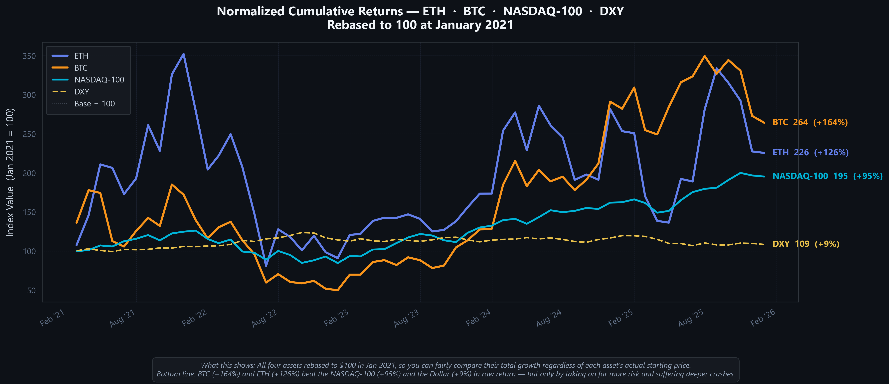

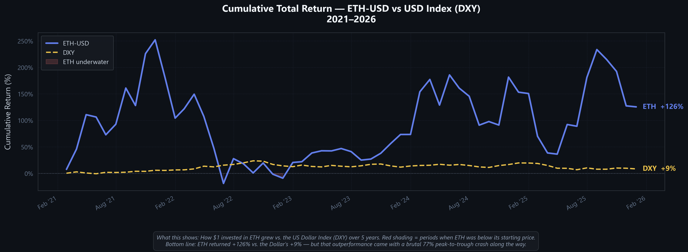

A few things stand out:

**1. Raw return is fine. Risk-adjusted return is not.** ETH beat the NASDAQ-100 on cumulative return (+126% vs +95%) but with four times the volatility for an extra 3.4 percentage points of CAGR. The Sharpe ratio of 0.17 is the worst of the four. A NASDAQ-100 investor captured 81% of ETH's CAGR with 25% of the vol, and never had a calendar year worse than -33%.

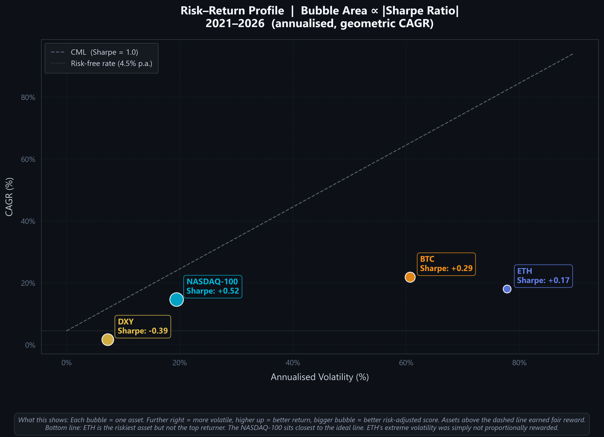

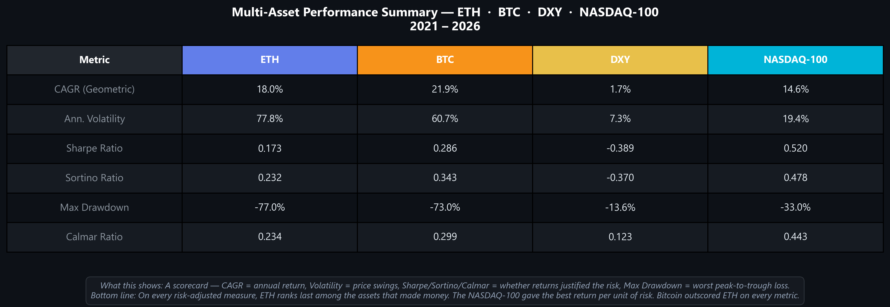

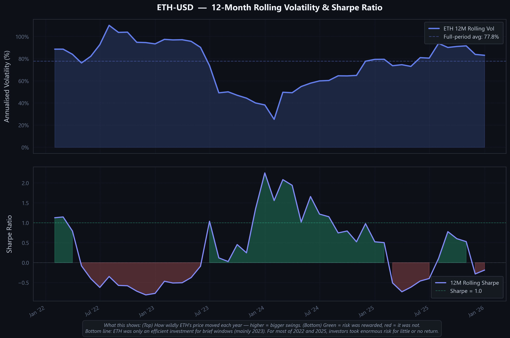

**2. ETH is not a USD hedge.** The Pearson correlation between ETH and DXY monthly returns is -0.011 with p = 0.934. Statistically indistinguishable from zero. OLS confirms: beta = -0.12, R^2 = 0.0001. The dollar explains essentially nothing about ETH's variance. So the popular "ETH benefits from dollar weakness" framing doesn't show up in this data.

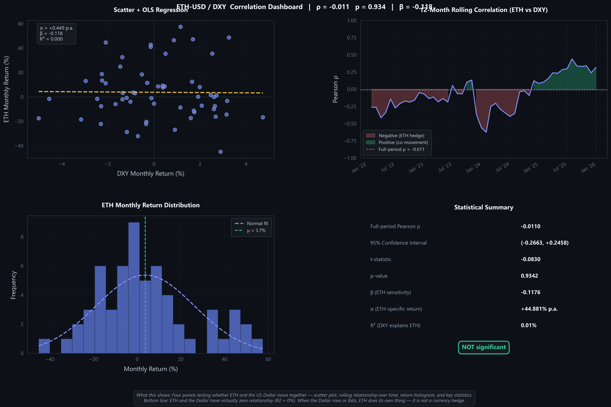

**3. ETH and BTC are basically one asset.** Full-period ETH-BTC correlation is 0.766 (p < 0.01). The rolling 12-month correlation averages 0.86 and rarely dips below 0.60. Holding both is a levered position on the same crypto cycle, not real diversification.

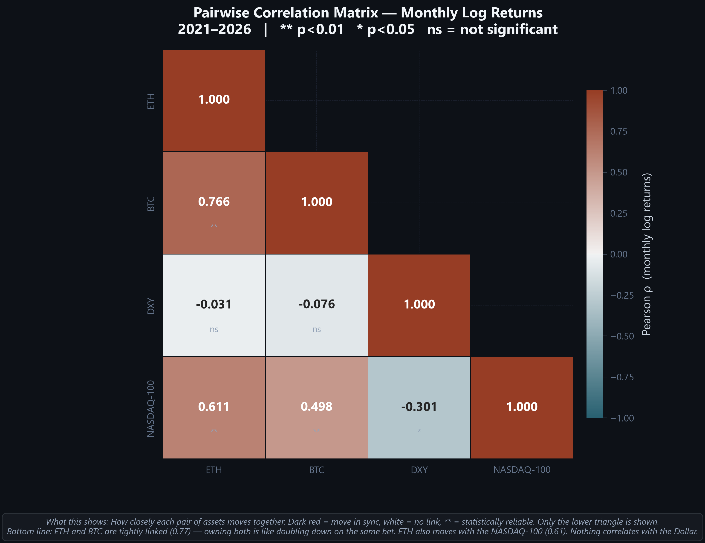

**4. ETH increasingly trades as a tech-equity proxy.** ETH vs NASDAQ-100 correlation is 0.611 (p < 0.05), averaging 0.622 on a 12-month rolling basis. That's persistent across the whole period. The relationship looks structural, not coincidental.

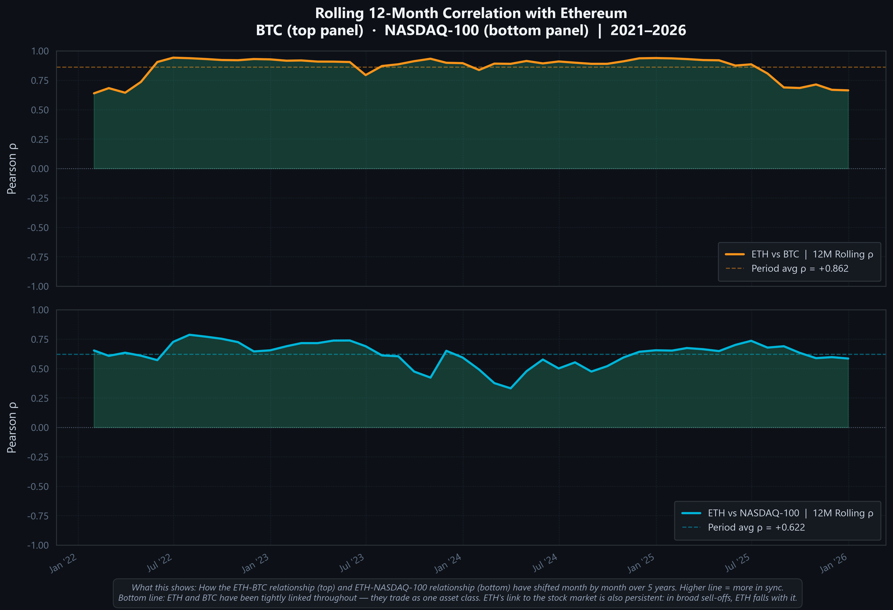

**5. The 18% CAGR is front-loaded.** Annual breakdown:

| Year | ETH | BTC | NASDAQ-100 |
|---|---:|---:|---:|
| 2021 | +208% | +44% | +29% |
| 2022 | -68% | -64% | -33% |
| 2023 | +91% | +155% | +54% |
| 2024 | +46% | +121% | +25% |
| 2025 | -11% | -6% | +20% |

Strip 2021 out and the rest of the period is roughly flat in real terms. ETH underperformed BTC in 2023 and 2024 (the two most recent bull years). And in 2025 ETH went negative while the NASDAQ-100 was up 20%. So even inside the risk-on bucket, ETH's relative position has weakened.

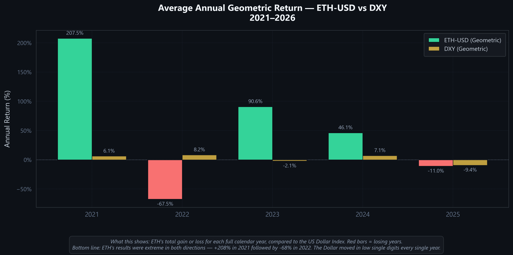

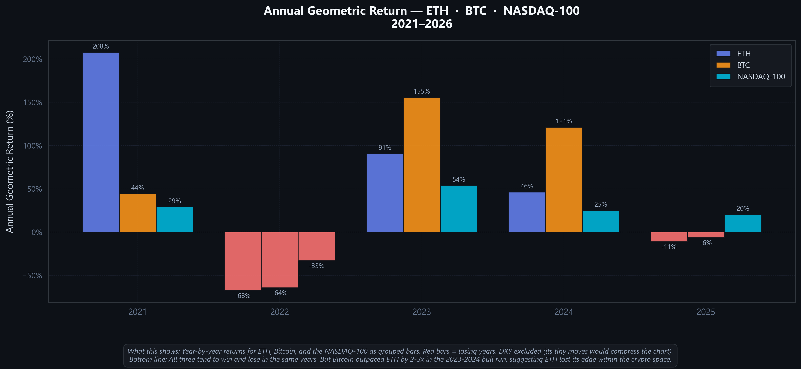

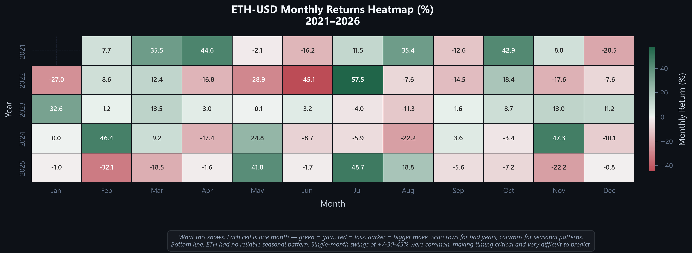

**6. Drawdown depth and duration are extreme.** Max drawdown of -77% was June 2022 - peak was around $4,800 in November 2021, trough around $1,050 in June 2022, so a -77% move over ~7 months. Recovery to prior peak was Q1-Q2 2024, so ~18-20 months from the trough. Total time underwater across the 60 months: about 26 months. Drawdowns of 20-40% in 2024-2025 are visible in Plot 5 too, so full peak recovery doesn't mean no further material losses.

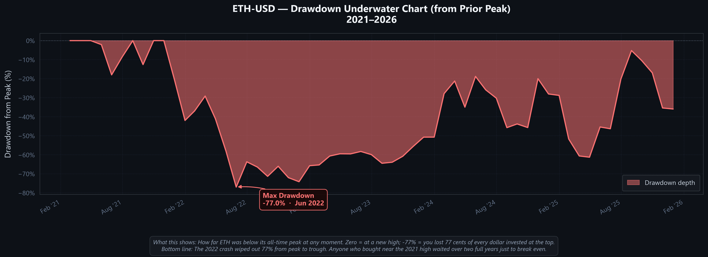

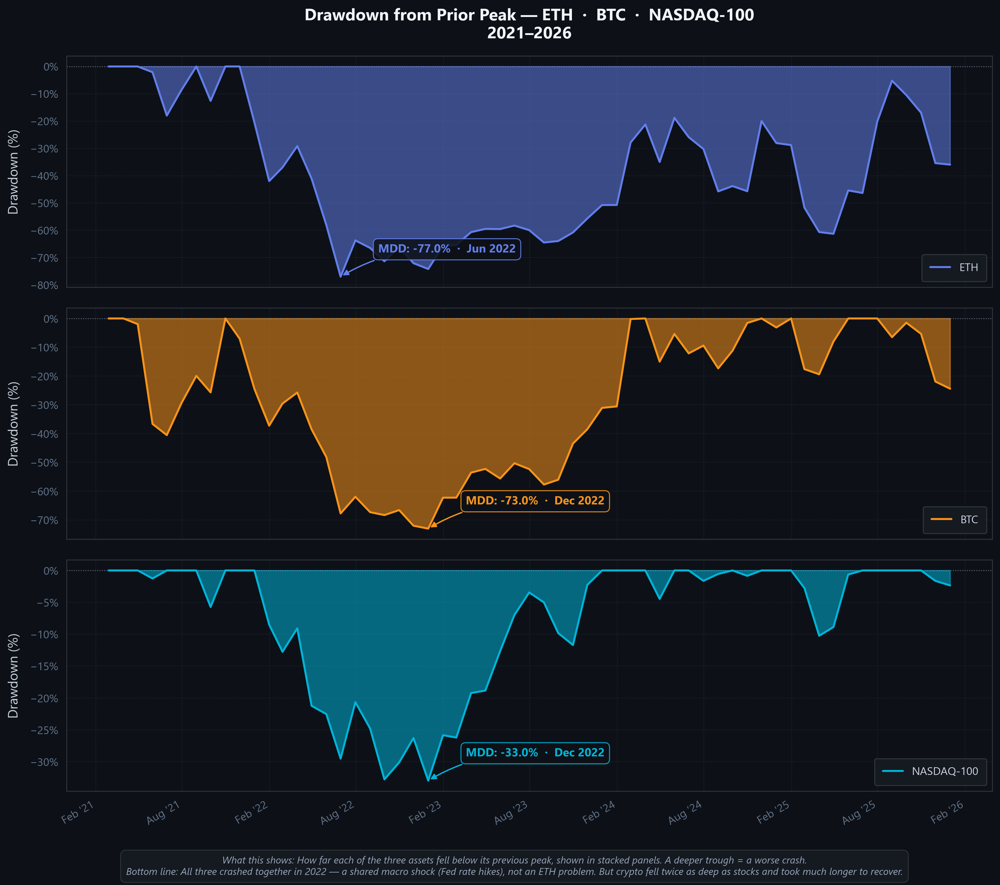

My read: ETH was worth holding as a small, cycle-timed allocation if you had the discipline for it. As a core or strategic position, it's hard to justify against BTC or NASDAQ-100 on a risk-adjusted basis over this window. Treat it like a high-beta speculation on the network's continued adoption, size positions to a loss tolerance of 75-80%, and don't expect the macro-hedge story to do work for you.

## Files

```
main.ipynb              The notebook (50 cells)
requirements.txt        Python deps
01_cumulative_returns.png
02_monthly_heatmap.png
03_annual_returns.png
04_rolling_vol_sharpe.png
05_drawdown.png
06_correlation_dashboard.png
07_normalized_cumulative.png
08_annual_comparison.png
09_risk_return.png
10_multi_drawdown.png
11_correlation_heatmap.png
12_rolling_correlations.png
13_metrics_table.png
```

## Disclaimer

This is a personal research project. Nothing in here is financial advice. Past performance of Ethereum or anything else doesn't predict future returns, and cryptocurrency can lose all of its value.
